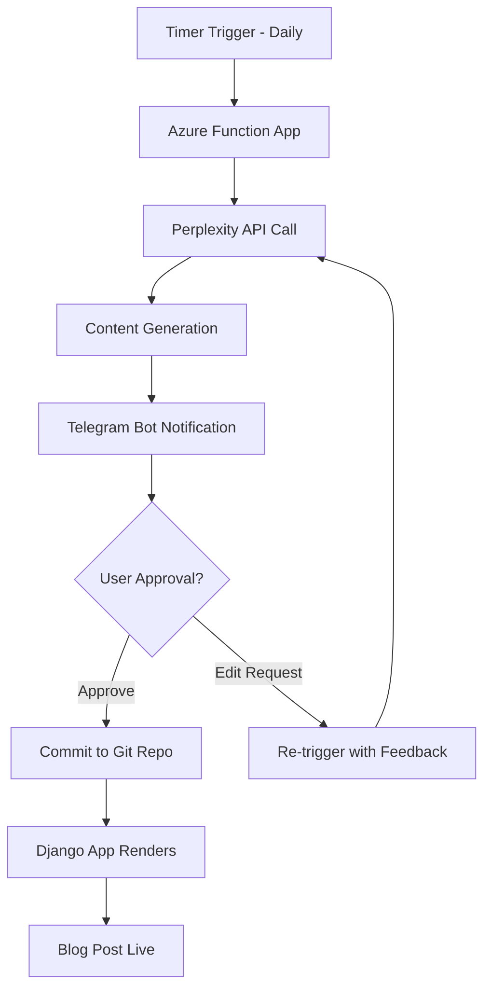

# Blog Post Automation - Architecture & Planning

## 🎯 Project Goals

Create an automated blog post generation system that:
- Generates daily content using Perplexity AI
- Implements human-in-the-loop approval via Telegram
- Stores approved content in Git repository
- Renders content via Django web application
- Uses Azure cloud infrastructure with IaC

## 🏗️ Architecture Overview

### System Flow


### Component Architecture
```
blogpostAutomation/
├── src/
│   ├── agents/
│   │   ├── content_agent.py      # Perplexity integration
│   │   ├── approval_agent.py     # Telegram workflow
│   │   └── git_agent.py          # Repository operations
│   ├── tools/
│   │   ├── perplexity_client.py  # API wrapper
│   │   ├── telegram_client.py    # Bot integration
│   │   └── git_operations.py     # Git commands
│   ├── models/
│   │   ├── blog_post.py          # Pydantic models
│   │   └── approval_state.py     # Workflow state
│   └── main.py                   # Azure Function entry point
├── terraform/
│   ├── main.tf                   # Main infrastructure
│   ├── functions.tf              # Function App config
│   ├── keyvault.tf              # Secrets management
│   └── variables.tf              # Configuration
├── .azure/
│   └── azure-pipelines.yml       # CI/CD pipeline
└── tests/                        # Unit tests
```

## 🔧 Technical Stack

### Core Technologies
- **Language**: Python 3.11+
- **Framework**: Azure Functions (Python)
- **AI**: Perplexity API
- **Communication**: Telegram Bot API
- **Storage**: Git Repository (GitHub/Azure DevOps)
- **Infrastructure**: Terraform + Azure
- **CI/CD**: Azure Pipelines

### Dependencies
```python
# Core
pydantic>=2.0
python-dotenv>=1.0
requests>=2.31

# Azure
azure-functions>=1.18
azure-keyvault-secrets>=4.7
azure-identity>=1.15

# External APIs
telebot>=4.15  # Telegram
gitpython>=3.1  # Git operations
```

## 📊 Data Models

### Blog Post Model
```python
class BlogPost(BaseModel):
    title: str
    content: str
    tags: List[str]
    created_at: datetime
    prompt_used: str
    approval_status: ApprovalStatus
```

### Approval Workflow
```python
class ApprovalState(BaseModel):
    post_id: str
    telegram_message_id: int
    user_feedback: Optional[str]
    iteration_count: int
    status: Literal["pending", "approved", "rejected", "editing"]
```

## 🔐 Security & Configuration

### Environment Variables
```bash
# Perplexity
PERPLEXITY_API_KEY=

# Telegram
TELEGRAM_BOT_TOKEN=
TELEGRAM_CHAT_ID=

# Git Repository
GIT_REPO_URL=
GIT_ACCESS_TOKEN=
GIT_BRANCH=main

# Azure
AZURE_KEYVAULT_URL=
```

### Azure Key Vault Integration
- All API keys stored in Azure Key Vault
- Function App uses managed identity
- Secrets rotated automatically

## 🚀 Deployment Strategy

### Infrastructure Provisioning
1. **Terraform Apply**: Create Azure resources
2. **Key Vault Setup**: Store secrets securely
3. **Function Deployment**: Deploy code via Azure Pipelines
4. **Configuration**: Set environment variables

### CI/CD Pipeline
```yaml
# Stages:
- Build & Test
- Infrastructure (Terraform)
- Deploy Function App
- Integration Tests
- Production Deployment
```

## 📝 File Naming Conventions

### Git Repository Structure
```
blog-content/
├── posts/
│   ├── 2024/
│   │   ├── 01/
│   │   │   ├── 2024-01-15-ai-trends.md
│   │   │   └── 2024-01-16-cloud-security.md
│   │   └── 02/
│   └── drafts/
├── templates/
└── assets/
```

### Blog Post Format
```markdown
---
title: "Post Title"
date: 2024-01-15
tags: ["ai", "technology"]
author: "Blog Automation"
---

# Post Content Here
```

## 🔄 Error Handling & Resilience

### Retry Logic
- Perplexity API: 3 retries with exponential backoff
- Telegram API: 5 retries with linear backoff
- Git operations: 2 retries with validation

### Failure Scenarios
1. **API Failures**: Log error, send admin notification
2. **Approval Timeout**: Auto-escalate after 24 hours
3. **Git Conflicts**: Create branch, notify for manual resolution
4. **Infrastructure Issues**: Azure monitor alerts

## 📊 Monitoring & Logging

### Application Insights
- Function execution metrics
- API call success rates
- User interaction patterns
- Error tracking and alerting

### Custom Metrics
- Daily post generation rate
- Approval/rejection ratios
- Average iteration count
- Response times per component

## 🧪 Testing Strategy

### Unit Tests
- Each agent module
- API client wrappers
- Data model validation
- Utility functions

### Integration Tests
- End-to-end workflow
- External API mocking
- Git operations
- Telegram bot responses

### Performance Tests
- Function cold start times
- API response times
- Memory usage patterns
- Concurrent request handling

## 📈 Future Enhancements

### Phase 2 Features
- Multiple content types (social media, newsletters)
- A/B testing for prompts
- Analytics dashboard
- Content scheduling
- Multi-language support

### Scalability Considerations
- Multiple blog support
- User management system
- Content categorization
- Advanced approval workflows